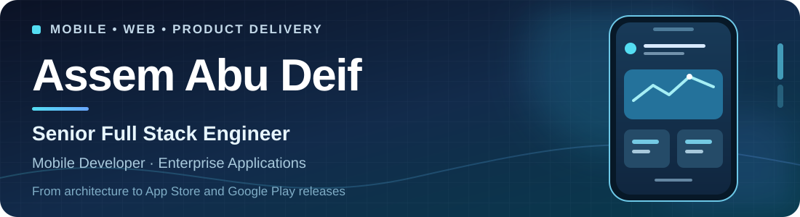

  

  
  
  
  

<strong>Flutter first. Product minded. Comfortable owning a release from build to store.</strong>

I build mobile and web products across enterprise ERP, POS, commerce, restaurants, education, and consumer apps. My main focus is Flutter, Dart, Riverpod, Bloc, Clean Architecture, REST APIs, and testing. I also bring hands-on full-stack experience with Laravel, Django, React, Next.js, Firebase, and Supabase.

## In numbers

| **14** enterprise apps | **4** built from scratch | **12** web + mobile apps | **14** App Store / **10** Google Play releases |
| :---: | :---: | :---: | :---: |
| SAPTEC product suite | POS, Approvals, Applications, Customer Portal | Web, Android, iOS; two others on Android and iOS | SAPTEC apps; the Google Play releases are Flutter apps |

## Featured work

### 01 · SAPTEC ERP — enterprise product suite

**Flutter development, React Native release work, and complete mobile store delivery.**

- Built **SAPTEC POS, Approvals, Applications, and Customer Portal** from scratch with Flutter and Riverpod.
- Continued development of **Cash Van, Support, Recycling, Connect, Production Application, and Sales Using Barcode**.
- Prepared and published **CRM, HR Portal, and School Portal**; continued development and published **Jordan Secret** using React Native.
- Implemented frontend workflows for barcode scanning, pricing, discounts, taxes, payments, returns, inventory, customer credit, permissions, attachments, and sessions through REST APIs.
- Managed certificates, signing, provisioning profiles, App Store Connect, Play Console submissions, review issues, and manual builds through Xcode and Android Studio. Created unit, widget, and integration tests and used AI-assisted workflows to support implementation and review.

> My SAPTEC work covers mobile/web frontend and REST API integration; backend development belonged to another scope.

### 02 · TATA Restaurant — three apps, one platform

Built the **Customer, Restaurant, and Delivery** Flutter applications from scratch with Riverpod and Clean Architecture. Implemented Firebase Authentication, Firestore, Storage, and Cloud Messaging. **All three apps were published on Google Play and the App Store.**

### 03 · FASTER Commerce Platform — full-stack build in progress

Building **Customer, Merchant, and Admin** applications from scratch. Designed the Supabase/PostgreSQL database, Row Level Security, migrations, storage policies, and server-side order logic, alongside realtime orders, checkout, delivery, notifications, and automated tests. **In development and preparation for release.**

### 04 · [Mounis](https://apps.apple.com/in/app/%D9%85-%D8%A4-%D9%86-%D8%B3/id6759240417) — personal iOS app

Designed, built, and published a privacy-focused Islamic lifestyle app with prayer times, Quran reading, adhkar, duas, notifications, and Qibla direction. [View it on the App Store](https://apps.apple.com/in/app/%D9%85-%D8%A4-%D9%86-%D8%B3/id6759240417).

<strong>More client projects and published apps</strong>

| Project | What I did | Link / status |
| --- | --- | --- |
| **[Awlad Elewa](https://github.com/assemabudeif/Awlad_Elewa_Backend)** | Built Laravel REST APIs and a Blade admin dashboard from scratch with MySQL; deployed both to Hostinger through cPanel. | [Public backend repository](https://github.com/assemabudeif/Awlad_Elewa_Backend) |
| **Souq Algomlah** | Built the Flutter wholesale marketplace from scratch with Bloc and REST APIs; handled both store releases. | [App Store](https://apps.apple.com/us/app/souq-algomlah/id6621180810) · [Google Play](https://play.google.com/store/apps/details?id=com.souqalgomlah.app) |
| **INSEP PRO** | Completed the remaining work on an existing Flutter app and published it on the App Store. | App Store release |
| **Elmohager** | Contributed alongside another developer and managed both store releases. | [Google Play](https://play.google.com/store/apps/details?id=com.elmohager.app.el_mohager) |
| **Alashanak** | Owned the student module: registration, courses, content, quizzes, exams, and progress tracking. | [Google Play](https://play.google.com/store/apps/details?id=com.alashanak.main) |
| **Up Town Eats** | Built the Flutter client from scratch and integrated existing REST APIs. | [Google Play](https://play.google.com/store/apps/details?id=com.flexicode.uptowneats) |

## Experience

| When | Role | Where | What I owned |
| --- | --- | --- | --- |
| Dec 2025–present | Flutter Developer | **SAPTEC ERP** | Enterprise frontend, REST API integration, testing, and Android/iOS releases. |
| Oct 2024–Nov 2025 | Full Stack Developer | **TIQNIQ.com** | Laravel and Django backends, React/Next.js frontends, cPanel deployment, and Flutter team contributions. |
| Jul–Sep 2025 | Flutter Developer, part time | **Souq Algomlah** | Built the marketplace from scratch, released it to both stores, and later delivered updates. |
| Mar–Jun 2025 | Flutter Developer, part time | **deepfort** | Built the Security App from scratch for compound security and resident experiences. |
| Oct 2023–Mar 2024 | Mobile Applications Developer | **Line Group Go Go Grow** | Developed and maintained eight Flutter apps and managed their Google Play and App Store releases. |
| Oct 2022–Sep 2023 | Flutter Instructor | **I CAN** | Taught eight students across two project-based cohorts. |

## Toolkit

  
  
  
  
  
  
  
  
  

| Area | Tools and approaches |
| --- | --- |
| Mobile and architecture | Flutter, Dart, React Native, Riverpod, Bloc, Provider, GetX, Clean Architecture, SOLID, responsive UI, localization |
| Backend and web | Laravel, Django, REST APIs, React, Next.js, Blade |
| Data and services | MySQL, PostgreSQL, Supabase, Firebase, Firestore, SQLite, Hive |
| Testing and API work | Unit, widget, and integration tests; Dio, Retrofit, HTTP, Postman |
| Release and tools | App Store Connect, Google Play Console, Xcode, Android Studio, cPanel, Hostinger, Git, GitHub |

## Public code

These repositories come from my TIQNIQ role. My contribution varied by project; Flutter applications were developed with a team.

<strong>Explore 14 project repositories</strong>

- [Seven Pets](https://github.com/tiqniaco/seven-pets)
- [Laundry App](https://github.com/tiqniaco/laundry-app) and [Laundry Backend](https://github.com/tiqniaco/laundry-app-backend)
- [Medical Center](https://github.com/tiqniaco/medical-center), [Laravel Backend](https://github.com/tiqniaco/medical-center-laravel), and [Admin](https://github.com/tiqniaco/medical_center_admin)
- [B2B Laravel](https://github.com/tiqniaco/b2b-laravel) and [B2B Partnership Laravel](https://github.com/tiqniaco/b2b-partnership-laravel)
- [Astar Backend](https://github.com/tiqniaco/astar-backend)
- [Yashfeen Frontend](https://github.com/tiqniaco/yashfeen-frontend), [Dashboard](https://github.com/tiqniaco/yashfeen-dashboard), and [Backend](https://github.com/tiqniaco/yashfeen-backend)
- [Kickboxing Project](https://github.com/tiqniaco/kickboxing-project)
- [TIQNIA Advanced Basic](https://github.com/tiqniaco/TIQNIA-Advanced-Basic)

## Beyond the code

- **BSc in Computer Science**, Faculty of Computers and Information, Minya University (2019–2023). Graduation project: A.
- **Full Stack Web Development Using Python**, Information Technology Institute (May–Oct 2024).
- **Technical Head and Core Team Member, GDG Minya** (Sep 2021–Oct 2023). Led a Flutter learning group for around 15 participants and delivered three technical sessions. Received two Golden Member awards and one Super Golden Member award.
- **Second place**, Ramadan Challenge by Eng. Tareq Al-Abd (Apr 2023). [Project repository](https://github.com/assemabudeif/ramadan_challenge).

---

  <strong>Let's build something useful.</strong> 
  Open to Flutter and mobile engineering opportunities and selected full-stack projects. 
  <a href="mailto:assem.abudeif@gmail.com">Email</a> · <a href="https://www.linkedin.com/in/assemabudeif/">LinkedIn</a> · <a href="https://assemabudeif.com">Portfolio</a> · <a href="https://docs.google.com/document/d/1M3R_ZFTkp__Iw_FdkE5NMqjw2UUo2_KOSyNQZRD0BL4/edit?usp=sharing">CV</a>

